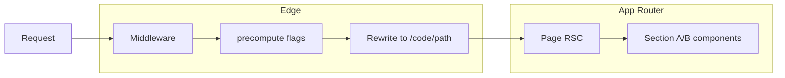

# A/B Testing Next.js App with Vercel Flags SDK

## Approach

Use the **Flags SDK** ([flags-sdk.dev](https://flags-sdk.dev)) (package: `flags`). It integrates with the **Vercel Toolbar** Flags Explorer so you can override flags per session during development and supports **precompute** so variants are decided at the edge (no layout shift, static-friendly).

- **Page-wise**: Middleware evaluates a page variant flag and rewrites to a dynamic segment that carries the precomputed flag state (e.g. `/[code]/...`). Each page route can have its own variant (e.g. home: control vs variant, about: control vs variant).
- **Section-wise**: Section-level flags (e.g. hero, CTA) are evaluated in React Server Components using the same precomputed `code` and flag group, so each section on a page can switch between variants (A/B) independently and without client-side flash.

---

## 1. Dependencies and env

- **Install**: `npm install flags`
- **Env**: Add `FLAGS_SECRET` (required for precompute and Toolbar). Generate with:  
  `node -e "console.log(require('crypto').randomBytes(32).toString('base64url'))"`  
  and set in `.env.local` and in Vercel project settings for production/preview.

---

## 2. Declare flags (`[flags.ts](flags.ts)` at project root)

- **Page-level flags** (one per page you want to A/B):
  - e.g. `homePageVariant`, `aboutPageVariant` with `options: [{ value: 'control', label: 'Control' }, { value: 'variant', label: 'Variant' }]` and `decide()` returning one of them (e.g. random or cookie-stable).
- **Section-level flags** (one per section you want to A/B):
  - e.g. `heroVariant`, `ctaVariant` with similar `options` and `decide()`.
- Export a **single precompute group** used by middleware and pages, e.g. `precomputeFlags = [homePageVariant, aboutPageVariant, heroVariant, ctaVariant, ...]`. Declare `options` on each flag so the Flags Explorer shows them and serialization stays small.

Use `identify` + cookie (and optional `dedupe`) if you need stable assignment per visitor (recommended for A/B). Middleware can set a visitor cookie and pass a header so the same visitor gets the same variant.

---

## 3. Middleware (`[middleware.ts](middleware.ts)` at project root)

- Use **precompute**: call `precompute(precomputeFlags)` and rewrite so the request is served from a route that receives the code.
- **Rewrite pattern**: e.g. rewrite `/` to `/${code}/`, `/about` to `/${code}/about`, so that the segment carrying the code is at the root. That implies moving pages under a dynamic segment: `**app/[code]/page.tsx**` (home), `**app/[code]/about/page.tsx**` (about), etc.
- **Matcher**: restrict to the paths that participate in A/B (e.g. `['/', '/about']` or a pattern).
- Optional: set a **visitor-id cookie** in the response and pass it via a request header so `identify` in flags can read it and `decide` is stable per visitor.

---

## 4. App route structure

- **Current**: `app/page.tsx`, `app/layout.tsx`, etc.
- **New**:
  - `**app/[code]/layout.tsx**`: minimal layout that just renders `children` (and optionally `generateStaticParams` returning `[]` for ISR).
  - `**app/[code]/page.tsx**`: home page. Await `params`, then call page and section flags with `homePageVariant(code, precomputeFlags)`, `heroVariant(code, precomputeFlags)`, etc., and render the right page/section variants.
  - `**app/[code]/about/page.tsx**` (or other pages): same idea—read `aboutPageVariant` and any section flags for that page from the same `code` and `precomputeFlags`.
- Pages that do **not** need A/B can stay outside `[code]` (e.g. `app/legal/page.tsx`). Middleware matcher should not rewrite those paths.

---

## 5. Section-wise rendering

- In each page under `app/[code]/`, call the section flags with the page’s `code` and `precomputeFlags` (e.g. `await heroVariant(code, precomputeFlags)`).
- Render conditionally: e.g. `heroVariant === 'a' ? <HeroA /> : <HeroB />`. Extract to small components (e.g. `<HeroSection variant={heroVariant} />`) if useful.
- All section variants for that page should use the **same** `code` and `precomputeFlags` so the page stays static and consistent.

---

## 6. Vercel Toolbar (Flags Explorer)

- Add the **discovery endpoint** so the Toolbar can list and override flags:
  - `**app/.well-known/vercel/flags/route.ts**`: use `createFlagsDiscoveryEndpoint` and `getProviderData` from `flags/next`, passing the object of all flags (e.g. import `* as flags from '@/flags'` or your flags module). Export `GET = createFlagsDiscoveryEndpoint(async () => getProviderData(flags))`.
- With `FLAGS_SECRET` set and the app deployed (or run locally with the Toolbar), you can override each flag in the Flags Explorer for your session (page- and section-wise) without changing code.

---

## 7. Optional: build-time vs ISR

- **ISR (recommended initially)**: In `app/[code]/layout.tsx` (or each page), use `export async function generateStaticParams() { return []; }` so the first request generates the variant and it’s cached. Avoids combinatoric explosion of precomputed variants.
- **Build-time**: Use `generatePermutations(precomputeFlags)` in `generateStaticParams` and return `codes.map(code => ({ code }))` to pre-render all variant combinations. Only feasible if the number of combinations is small; otherwise stick to ISR.

---

## 8. Files to add/change (summary)

| Action        | File                                                                                                             |
| ------------- | ---------------------------------------------------------------------------------------------------------------- |
| Add           | `[flags.ts](flags.ts)` – page + section flags, `precomputeFlags` array                                           |
| Add           | `[middleware.ts](middleware.ts)` – precompute, rewrite to `/[code]/...`, optional visitor cookie                 |
| Add           | `app/.well-known/vercel/flags/route.ts` – discovery endpoint for Toolbar                                         |
| Add           | `app/[code]/layout.tsx` – pass-through layout, optional `generateStaticParams` for ISR                           |
| Move/refactor | `app/page.tsx` → `app/[code]/page.tsx` – read `code` from params, evaluate home + section flags, render variants |
| Add (example) | `app/[code]/about/page.tsx` – second page with its own page flag + section flags                                 |
| Keep          | `app/layout.tsx` – root layout unchanged                                                                         |
| Env           | `.env.local` and Vercel: `FLAGS_SECRET`                                                                          |

---

## 9. Consistency and UX

- **Sticky variant**: Use a cookie (set in middleware) and pass it into `identify` so `decide` returns the same variant for the same visitor across requests. Middleware must set the cookie on the response and, on first request, pass the new id via a header so the first render sees it.
- **No layout shift**: Because variants are resolved in middleware (precompute) and in RSC with the same code, the correct variant is rendered on the server; no client-side toggle or spinner.

---

## References

- [Flags SDK – Next.js Quickstart](https://flags-sdk.dev/frameworks/next)
- [Flags SDK – Precompute](https://flags-sdk.dev/frameworks/next/precompute)
- [Flags SDK – Edge Middleware example](https://flags-sdk.dev/frameworks/next/examples/edge-middleware)
- [Vercel – Feature flags pattern](https://vercel.com/docs/feature-flags/feature-flags-pattern)
- [Vercel – Flags Explorer / Toolbar](https://vercel.com/docs/feature-flags/flags-explorer)
